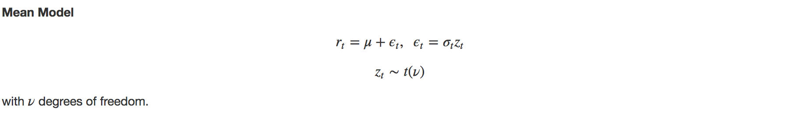
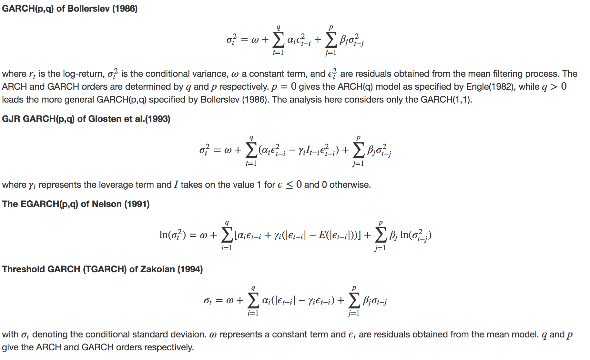

```{r setup, include=FALSE}
knitr::opts_chunk$set(echo = FALSE, dpi=300, fig.height = 4, fig.path = "plots/README/README-")

#source("./R/01_import_and_clean.R")
load("~/Documents/GitHub/VolatilityModelling/cache/models_22_19.RData")

library(timetk)
library(xts)
library(tidyverse)
library(forecast)
library(dynlm)
library(cowplot)
library(GGally)
library(lmtest)
library(FinTS)
library(broom)
library(rugarch)
library(scales)

```

## Introduction 

Volatility permeates the economy. It influences the pricing of assets and plays a prominent role in financial decision-making. One area of application is Value-at-Risk (VaR) modelling, which seeks to quantify the potential financial losses and the probability of their occurance. Firms and regulators alike use VaR as a risk management tool. However, simple VaR models fail to capture volatility clustering, thereby overestimating risk in calm times and underestimating risk in volatile times.

One solution to this problem is to feed VaR models conditional (time-varying) variance forecasts. This analysis uses eight different Generalized Autoregressive Conditional Heteroskedasticity (GARCH) model specifications to conduct daily VaR forecasts for 6 major stock market indices. 

## Data

This analysis considers daily prices of 6 major stock market indices:

   * S&P 500
   * Dow Jones Industrial Average
   * FTSE 100
   * DAX Performance-Index
   * CAC 40
   * Nikkei 225
   
All data is retrieved from Yahoo using the `quantmod` package for the period January 1, 2019 to September 15, 2019. The level as well as daily log-returns of each index is plotted below.
   
**Stock Market Indices Daily Price: 2000 - 2019**
```{r, price_by_index, echo = FALSE, warnings = FALSE, out.width ='100%'}
# Stock Market Indices Daily Price: 2000 - 2019
indices %>% 
   tk_tbl(rename_index = "date") %>% 
   gather(market_index, price, -date) %>% 
   mutate(market_index = fct_relabel(market_index, ~str_remove(., ".Adjusted"))) %>% 
ggplot(aes(x = date, y = price)) +
   geom_line() +
   facet_wrap(~market_index, scale = "free_y") +
   labs(x = NULL,
        y = "Price (local currency)") +
   theme_minimal() +
   theme(axis.text.x = element_text(angle = 45),
         strip.background = element_rect(fill = "grey90"))
```

**Stock Market Index Returns: 2000 - 2019**
``` {r, log_return_by_index, echo = FALSE, out.width ='100%'}
# Stock Market Index Returns: 2000 - 2019
nested_returns %>% 
   unnest(cols = data) %>% 
   ungroup() %>% 
   mutate(market_index = fct_relabel(market_index, ~str_remove(., ".Adjusted"))) %>% 
ggplot(aes(x = date, y = return)) +
   geom_line() +
   facet_wrap(~market_index) +
   labs(x = NULL,
        y = "Daily Log Return") +
   theme_minimal() +
   theme(axis.text.x = element_text(angle = 45),
         strip.background = element_rect(fill = "grey90"))
```

Each log-return series exhibits heteroscedasticity or volatiltiy clustering, the phenomenon first described by Mandelbrot (1963): "large changes tend to be followed by large changes of either sign, and small changes tend to be followed by small changes." Periods of high volatility are clearly visible in late 2008 as well as in 2002.

The ACF and PACF plots of each index's squared returns show serial correlations, indicating daily returns are not independent and signalling the presence of ARCH-effects.

```{r, acf_returns_by_index_build, eval = TRUE, include = FALSE}
# names of ACFs to plot
squared_returns<- returns %>% 
   # calculate square returns
   mutate_if(is.numeric,~ .^2)

acf_squared_returns <- map(names(squared_returns)[-1], ~ggAcf(squared_returns[[.]], lag.max = 50) + 
                                          labs(title = NULL,
                                               y = NULL,
                                               subtitle = paste0(str_remove(., ".Adjusted"), " squared returns")))

# sub grid with ACF plots
acf_grid <- plot_grid(plotlist = acf_squared_returns, ncol = 3)

# create title 
title_acf <- ggdraw() + 
   draw_label("ACF of Stock Market Index Squared Returns",
              fontface = 'bold',
              x = 0,
              hjust = 0,
              size = 12
   ) +
   theme(plot.margin = margin(0, 0, 0, 7))
```

```{r, acf_returns_by_index, echo = FALSE, out.width ='100%'}
# plot ACF of squared returns by index
plot_grid(title_acf, acf_grid, ncol = 1, rel_heights = c(0.05, 1))
```

```{r, pacf_squared_returns_build, eval = TRUE, include = FALSE}
pacf_squared_returns <- map(names(squared_returns)[-1], ~ggPacf(squared_returns[[.]], lag.max = 50) + 
                              labs(title = NULL,
                                   y = NULL,
                                   subtitle = paste0(str_remove(., ".Adjusted"), " squared returns")))

# sub grid with ACF plots
pacf_grid <- plot_grid(plotlist = pacf_squared_returns, ncol = 3)

# create title 
title_pacf <- ggdraw() + 
   draw_label("PACF of Stock Market Index Squared Returns",
              fontface = 'bold',
              x = 0,
              hjust = 0,
              size = 12
   ) +
   theme(plot.margin = margin(0, 0, 0, 7))
```

```{r, pacf_squared_returns, echo = FALSE, out.width ='100%'}
# plot ACF of squared returns by index
plot_grid(title_pacf, pacf_grid, ncol = 1, rel_heights = c(0.05, 1))
```

## Models

The analysis considers eight univariate GARCH model specifications. Each model assumes returns are normally distributed with a time-varying variance.





## Forecasts

All models and forecasts are computed using the `rugarch` package. 

```{r, forecasts, echo=FALSE, out.width='100%', include = FALSE}
vol <- rolling_forecasts %>% 
   gather(model, forecast, -c(market_index, data, data_xts)) %>% 
   separate(model, into = c("model", "sample_size"), sep = "_n") %>% 
   select(-data, -data_xts) %>% 
   mutate(sample_size = parse_number(sample_size),
          report = map(forecast, ~report(., VaR.alpha = 0.05)@forecast$VaR),
          report = map(report, ~rownames_to_column(., var = "date"))) %>% 
   unnest(cols = report) %>% 
   ungroup() %>% 
   mutate(date = parse_date(date, format = "%Y-%m-%d")) %>% 
   filter(sample_size == 4000) %>% 
   mutate(model = str_replace(model, "_", " "), 
          market_index = str_replace(market_index, ".Adjusted", "")) %>% 
ggplot() +
   geom_line(aes(x = date, y = realized), alpha = 0.5) +
   geom_line(aes(x = date, y = `alpha(1%)`), col = "blue", alpha = 0.7) +
   theme_minimal() +
   facet_grid(model ~ market_index, scale = "free_y") +
   scale_x_date(label = date_format("%b-%y"),
                date_breaks = "3 months") +
   labs(title = "One Day Ahead Value-at-Risk Forecasts \nby Market Index and Model Specification",
        x = NULL,
        y = "Daily log-return") +
   theme(axis.text.x = element_text(angle = 90, vjust = -.01))
```

```{r, forecast_plot, fig.height=8, echo=FALSE, out.width='100%'}
vol
```


