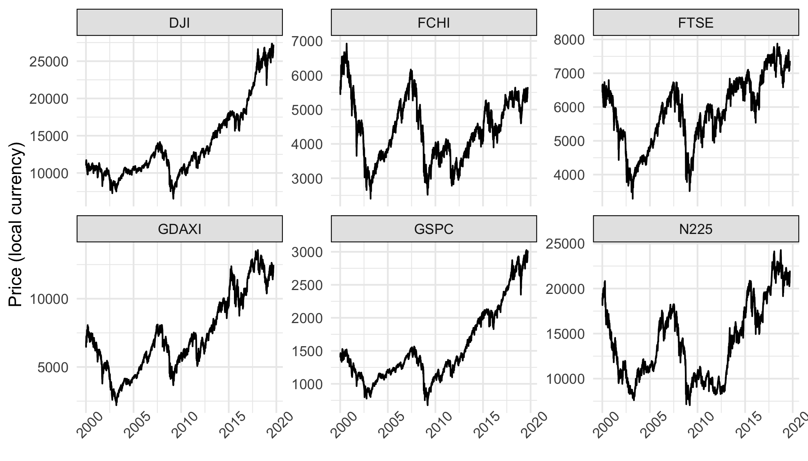
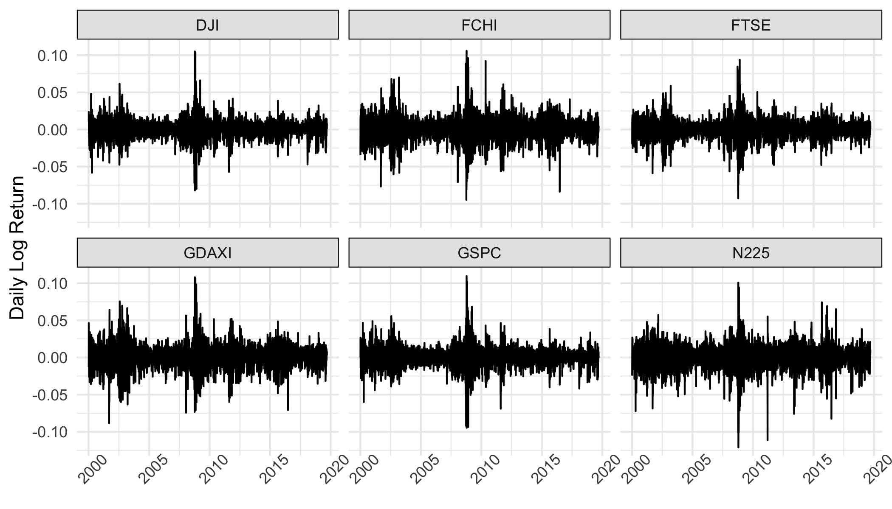
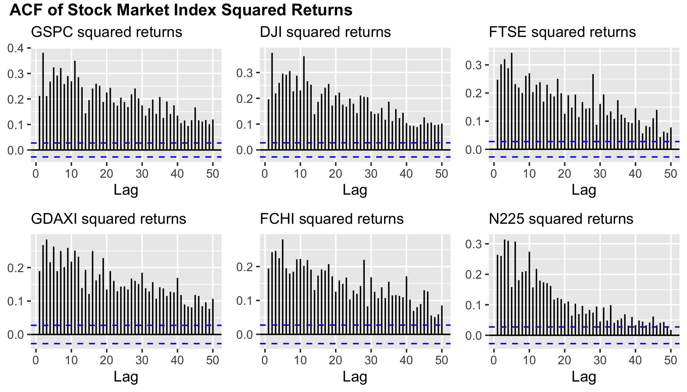
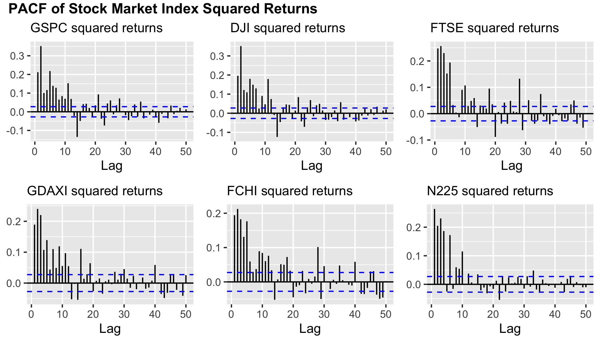
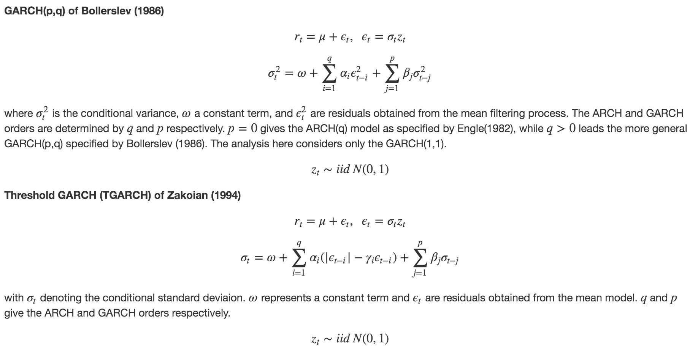

An Evaluation of Value-at-Risk Forecasting Methods
================

## Introduction

Volatility permeates the economy. It influences the pricing of assets
and plays a prominent role in financial decision-making. One area of
application is Value-at-Risk (VaR) modelling, which seeks to quantify
the potential financial losses and the probability of their occurance.
Firms and regulators alike use VaR as a risk management tool. Since the
groundbreaking work of Engle (1982), many different approaches have been
developed to model and forecast volatility. This analysis assesses the
performance of a wide set of popular univariate volatiltiy models in
terms of daily VaR forecasts for 6 major stock market indices, and
considers how dimensions such as sample length and parameterization
affect VaR forecasts.

## Data

This analysis considers daily prices of 6 major stock market indices:

  - S\&P 500
  - Dow Jones Industrial Average
  - FTSE 100
  - DAX Performance-Index
  - CAC 40
  - Nikkei 225

All data is retrieved from Yahoo using the `quantmod` package for the
period January 1, 2019 to September 15, 2019. The level as well as daily
log-returns of each index is plotted below.

**Stock Market Indices Daily Price: 2000 - 2019**

**Stock Market Index Returns: 2000 - 2019**

Each log-return series exhibits heteroscedasticity or volatiltiy
clustering, the phenomenon first described by Mandelbrot (1963): “large
changes tend to be followed by large changes of either sign, and small
changes tend to be followed by small changes.” Periods of high
volatility are clearly visible in late 2008 as well as in 2002.

The ACF and PACF plots of each index’s squared returns show serial
correlations, indicating daily returns are not independent and
signalling the presence of
ARCH-effects.

## Models

This analysis considers …

